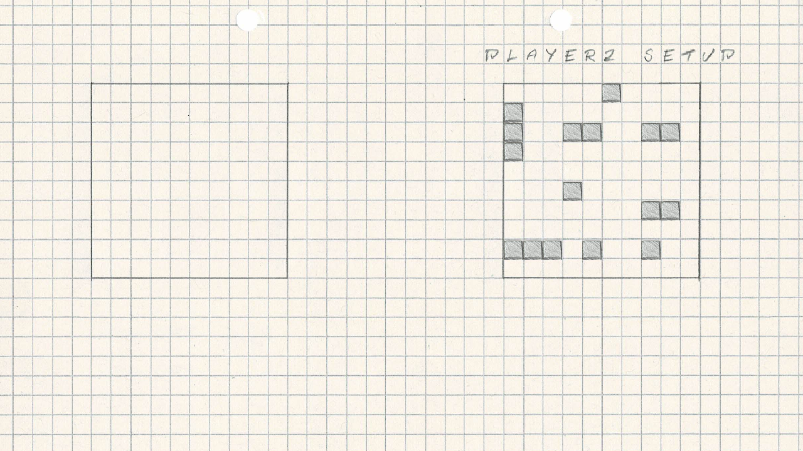
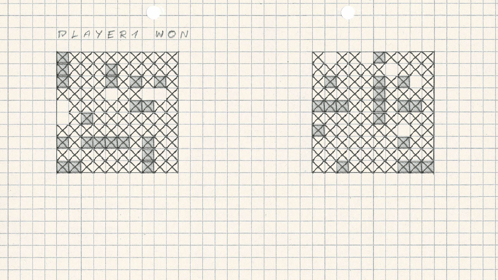
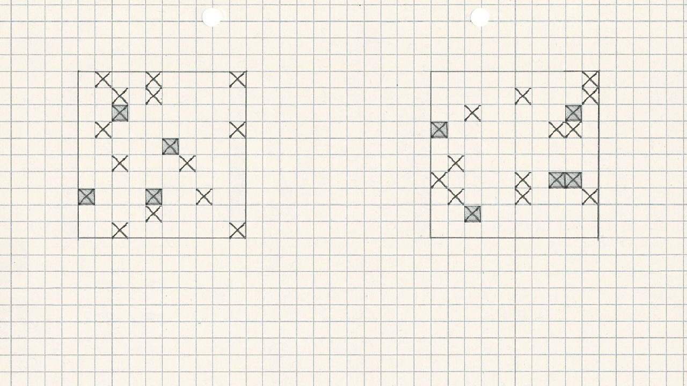
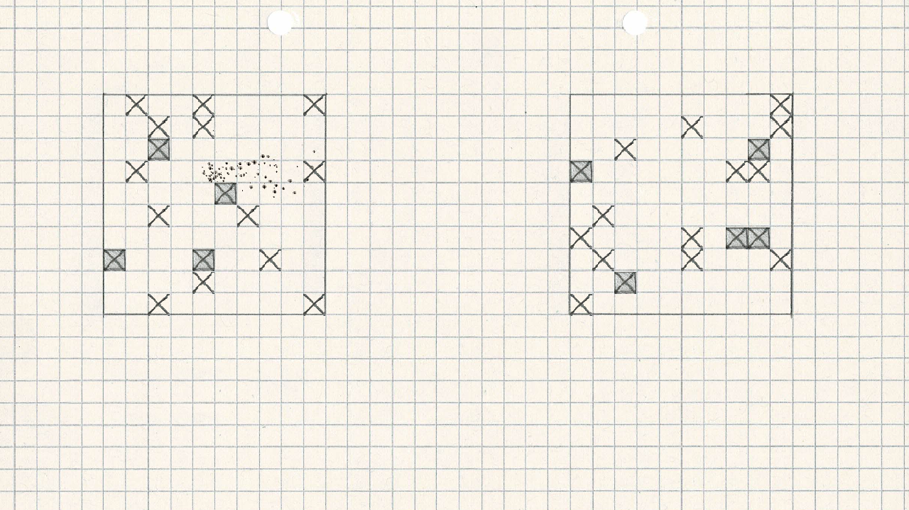
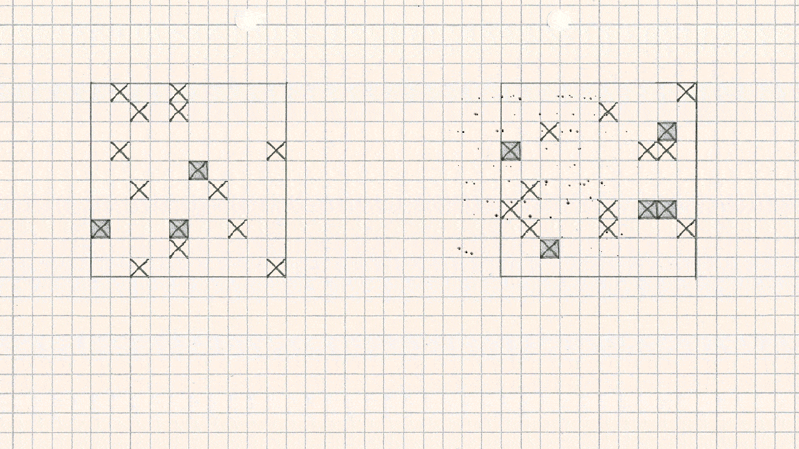

# Battleships OpenGL
This is a battleship game written in Java with use of LWJGL, originally make for school work, it's based on The Cherno's Flappy Bird Tutorial https://github.com/TheCherno/Flappy ( The math library and coordinate transformations mainly).

This is a Work In Progress, the game uses all the basic Java 8 features like Lambdas, Generics and Streams, at least I've tried to get it be be as compient to Java standards as possible. The LWJGL is a great tool to use, and it was the easiest thing to setup in this project.

The game itself is a little convoluted, I wanted to try and merry the game objects with OpenGL code as to make the game code read objects and render them at the same time. The basic game works, it's crude and has practically no user interface but all the game logic works and the winner is chosen.

Here are some screenshots:

